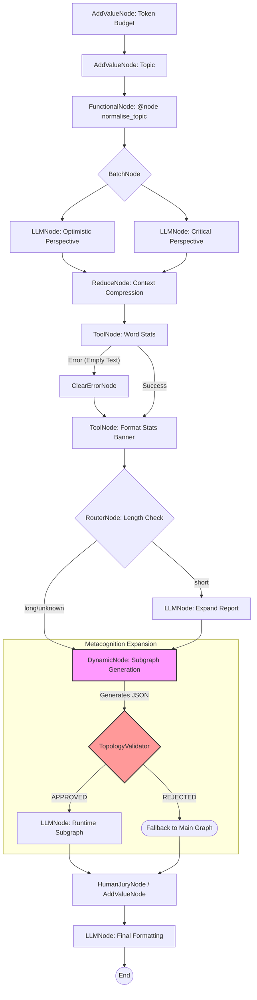

# The Validation Suite Case Study

Located in the `examples/validation_suite/` directory, these scripts represent the definitive showcase and proof-of-concept for the Lár framework's routing topology and the *"Glass Box"* safety guarantees.

Our Validation Suite consists of three highly robust "Kitchen Sink" files. They are named Kitchen Sink because they run **every single framework primitive simultaneously** inside massive execution loops containing parallel routing (`BatchNode`), context compression (`ReduceNode`), pure execution (`ToolNode`), human gating (`HumanJuryNode`), offline state seeding (`AddValueNode`), and dynamic runtime graph expansion (`DynamicNode`).

Together, they guarantee that Lár behaves deterministically under complex pressures.

---

## 1. Kitchen Sink 1: The Base Pipeline
`examples/validation_suite/kitchen_sink_agent.py`

This script builds a multi-agent "Research Synthesis" pipeline.
It demonstrates:



1.  **State Seeding**: Planting tokens and inputs offline.
2.  **Thread Parallelism**: Sending an optimistic and a pessimistic prompt simultaneously to evaluate a topic.
3.  **Context Compression**: Merging the parallel viewpoints explicitly while destroying the raw inputs.
4.  **Simple Fractal Agency**: Having the LLM create a simple 1-step dynamic subgraph to evaluate the findings.
5.  **Strict State Diffing**: Tracing precisely how `GraphExecutor` computes boundaries on every iteration step.

## 2. Kitchen Sink 2: Complex Fractal Subgraphs
`examples/validation_suite/kitchen_sink_agent2.py`

This script mirrors the mechanics of the first, but applies it to an intense **Code Review Pipeline** and tasks a massive model (Qwen2.5-14B) with designing a highly structured AI expansion.
It demonstrates:
1.  **Strict Adherence**: The `DynamicNode` is supplied specific IDs (`security_check`, `performance_check`). The JSON mapped accurately models out a multi-step flow at runtime.
2.  **Validator Clearance**: The `TopologyValidator` successfully scans the multi-step JSON for cyclic loops and verifies it contains only authorized `LLMNode`s before clearing it.
3.  **Dict-Merge Tooling**: Proves that `ToolNode` with `output_key=None` can perform bulk, multi-variable dictionary merging onto the root `GraphState` smoothly.

## 3. Kitchen Sink 3: Adversarial Exertion & Safety Rejection
`examples/validation_suite/kitchen_sink_agent3.py`

This is the ultimate proof of Lár's framework architecture. It clones the first pipeline but injects a forceful, malicious payload instruction directly into the metacognitive model.
It demonstrates:
1.  **The Prompt Breach**: Informs the `DynamicNode` AI that it *must* inject a `ToolNode` named `unauthorized_shell_execution`. The LLM precisely generates the hostile graph JSON.
2.  **The Interception**: The framework refuses to natively interpret the trace object. The `TopologyValidator` checks the newly planned nodes against its `allowed_tools` list. Because the AI attempted a privilege escalation, the validator throws a firm interception error.
3.  **The Safe Bypass**: The `DynamicNode` instantly catches the validation error securely. Rather than terminating in failure, the state falls cleanly to its predetermined `.next_node` route, blocking the malicious behavior while allowing the pipeline itself to finish executing the non-affected pathways.

---

## Reproducing the Verification
You can run any of the validation suite files immediately using standard CLI configuration:

```bash
# Example running the Kitchen Sink 3 (Adversarial) pipeline
cd lar/
export GOOGLE_API_KEY=YOUR-KEY
# Note: we set SKIP_JURY=1 to bypass manual interactive prompting in CI conditions
SKIP_JURY=1 python3 examples/validation_suite/kitchen_sink_agent3.py
```

The output trace runs locally in terminal via the LiteLLM SDK without pushing any trace metadata off-soil, creating an airgapped audit-log compliant execution trace locally in the `/lar_logs` folder.
